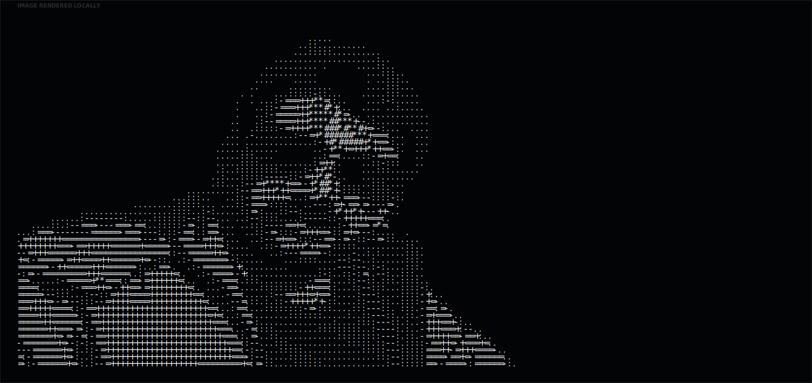
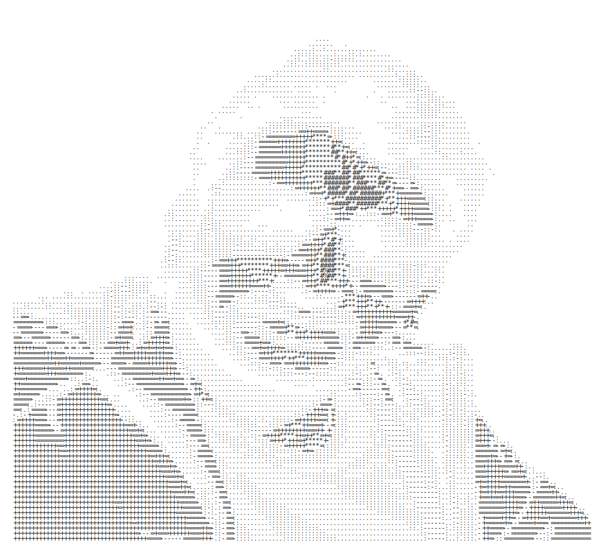

## Hi there 👋
<!-- 

  

 -->

<!--  -->
<!--  -->
<!--
**spacexplorer20-ship/spacexplorer20-ship** is a ✨ _special_ ✨ repository because its `README.md` (this file) appears on your GitHub profile.

Here are some ideas to get you started:

- 🔭 I’m currently working on ...
- 🌱 I’m currently learning ...
- 👯 I’m looking to collaborate on ...
- 🤔 I’m looking for help with ...
- 💬 Ask me about ...
- 📫 How to reach me: ...
- 😄 Pronouns: ...
- ⚡ Fun fact: ...
-->

<!-- 

  

 -->

  

  
  

  &nbsp;
  &nbsp;
  &nbsp;
  

## 💫 About Me

- 🔭 Built KG-RAG pipelines, PINNs for fluid dynamics
- 🌱 Currently learning MLOps
- 👯 Looking to collaborate on AI/data tooling, MLOps pipelines and data engineering
- 💬 Ask me about KG-RAG, PINNs, QGIS, HEC-RAS hydraulic modelling, or Godot/RPG Maker dev
- 📫 How to reach me: **YOUR_EMAIL**
- ⚡ Fun fact: I make small games in unity, godot and rpg maker
- 👨‍💻 Explore all my projects on [GitHub](https://github.com/YOUR_GITHUB_USERNAME?tab=repositories)

 

## 🔥 Current Focus

  <table>
    <tr>
      <td align="center" width="33%">
        <b>Research</b> 
        PINNs, KG-RAG  
      </td>
      <td align="center" width="33%">
        <b>MLOps</b>       
      </td>
      <td align="center" width="33%">
        <b>Game Dev</b> 
        Unity, RPG Maker MZ
      </td>
    </tr>
  </table>

<!--  

## 🛠 Proof of Work

Green squares are cheap — here's what actually shipped.

> Swap these in with your own merged PRs, competition results, or deployed projects:

**[Project / PR name](https://github.com/YOUR_GITHUB_USERNAME/repo/pull/N)** · One or two lines on what broke, what you changed, and why it mattered. Language, +lines/−lines, merged Month Year.

**[Project / PR name](https://github.com/YOUR_GITHUB_USERNAME/repo/pull/N)** · Same format — keep it concrete and specific, not a skills list.

  -->

## ⚔️ Tech Stack

  

  <kbd>
    <kbd>Research / ML</kbd>  
    
    
    
    
  </kbd>
  <!--    -->
  <kbd>
    <kbd>Game Dev</kbd>  
    
    
    
  </kbd>
  <!--    -->
  <kbd>
    <kbd>Cloud / MLOps</kbd>  
    
    
    
    
  </kbd>
  <!--    -->
  <kbd>
    <kbd>Editors</kbd>  
    
    
  </kbd>

 

## 📊 GitHub Stats & Activity

  
  

  

  

<!-- ## 🏆 Profile Trophy

  

 -->

 
<!--## 🧩 Profile Summary

 

  

   -->
  

<!-- 

  

 -->

 

## 🐍 Contribution Snake

<picture>
  <source media="(prefers-color-scheme: dark)" srcset="https://raw.githubusercontent.com/spacexplorer20-ship/spacexplorer20-ship/output/github-contribution-grid-snake-dark.svg">
  <source media="(prefers-color-scheme: light)" srcset="https://raw.githubusercontent.com/spacexplorer20-ship/spacexplorer20-ship/output/github-contribution-grid-snake.svg">
  
</picture>

Needs a GitHub Actions workflow (Platane/snk) running on your repo to generate the SVGs — ask if you want that workflow file too.

  

## 🤝 Connect

  
  
  

 

  <i>Building in the open,</i>
   
  <b>Sayan</b>

